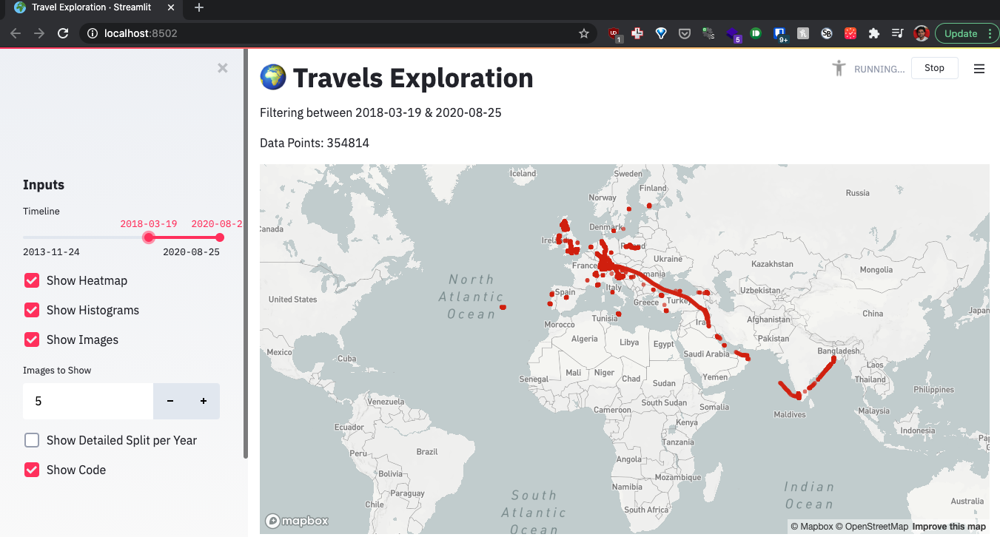
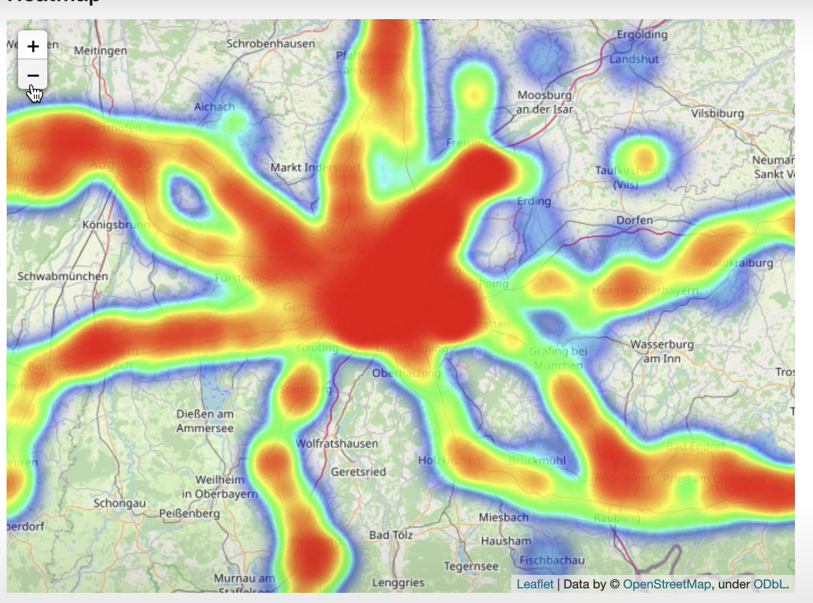
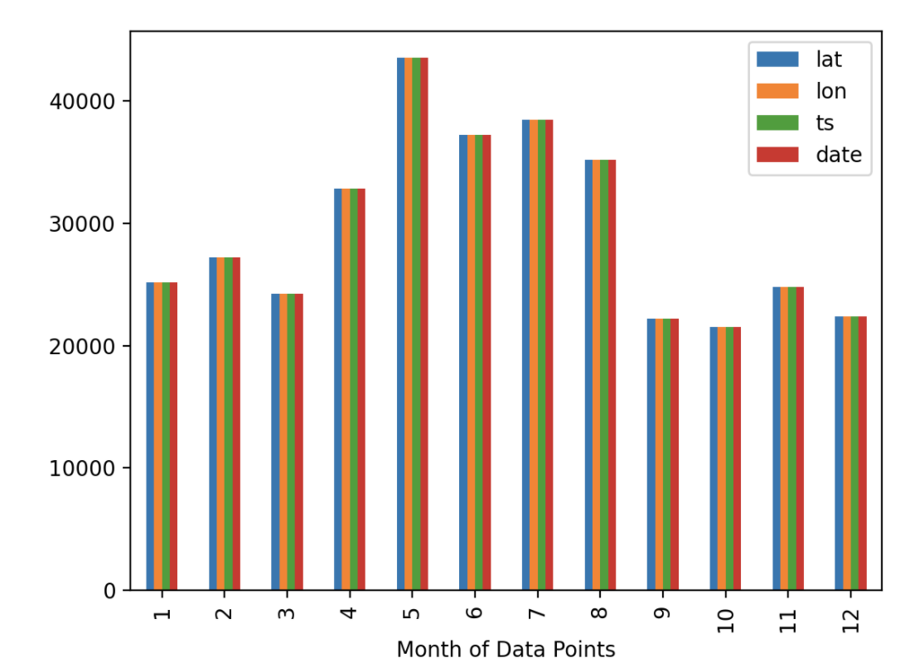

# streamlit-data-viz-demo
A demo application to visualize the travel information from Google Maps Timeline using Streamlit in Python.

The demo application allows the user to interactively filter the data based on time periods. The heatmaps for the locations can also be plotted. Along with the heatmaps, there is an option to show histograms for the data points by different time periods like hour, months & years. Additionally, a specified number of random images can be obtained from [Flickr](https://www.flickr.com/) images of the locations in the dataset. 

### Installation
Install the dependencies

``pip install -r requirements.txt``

### Instructions for Running 

1. Get the Google Maps location history from [Google Takeout](https://takeout.google.com/settings/takeout). 

2. Clean the data by running `data_cleaning.py`. It removes all data except latitude, longitude & timestamps. The data is also converted in to the standard format.

3. For getting images from Flickr, you need to create an [app](https://www.flickr.com/services/apps/create/) & get the API key & secret.  
The API key & secret are stored in a `.env` file. 
Create a copy of `.env.example` & rename it to `.env` & add the values for the app secret & api key for Flickr services.

4. Run the streamlit app using

    `` streamlit run travel_viz.py``

    The application will run on localhost:8501 by default.

5. To use Mapbox for the streamlit maps, please configure the settings following the documentation on [Streamlit](https://docs.streamlit.io/en/latest/streamlit_configuration.html#view-all-config-options). 

### Screenshots

 
